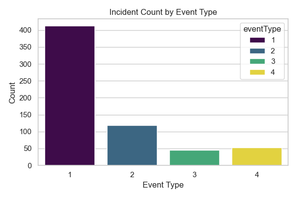
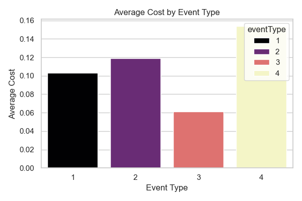
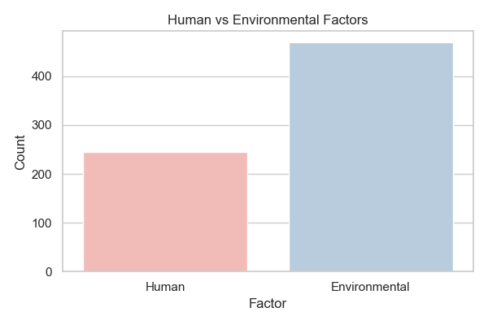
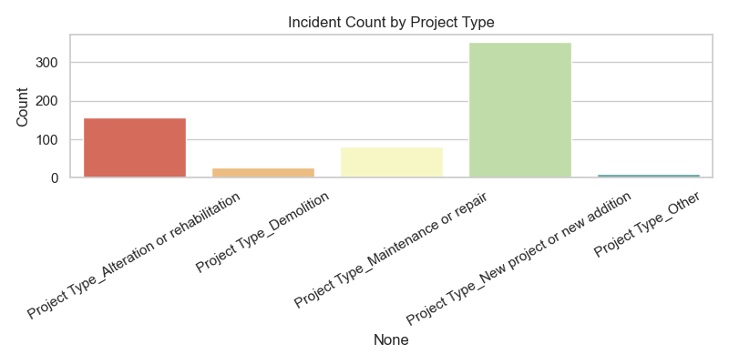
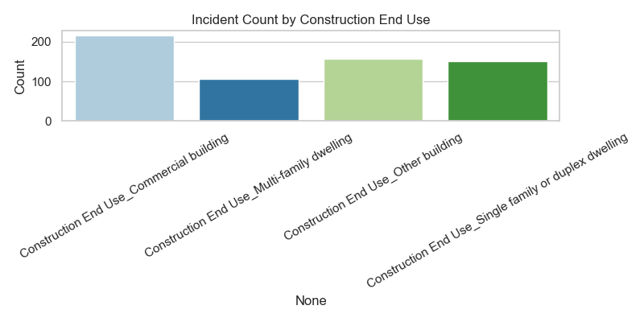
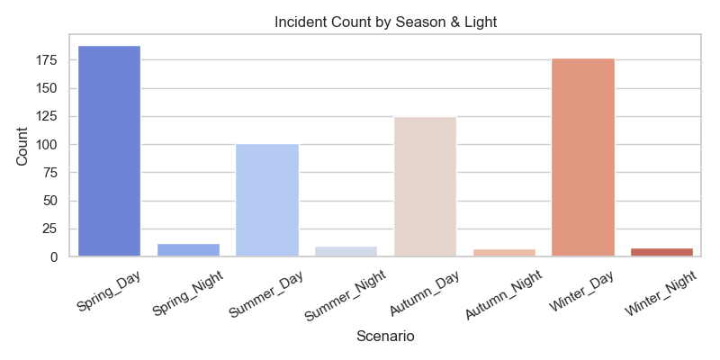
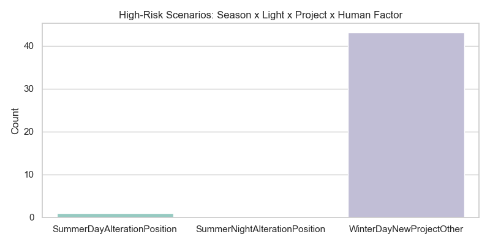
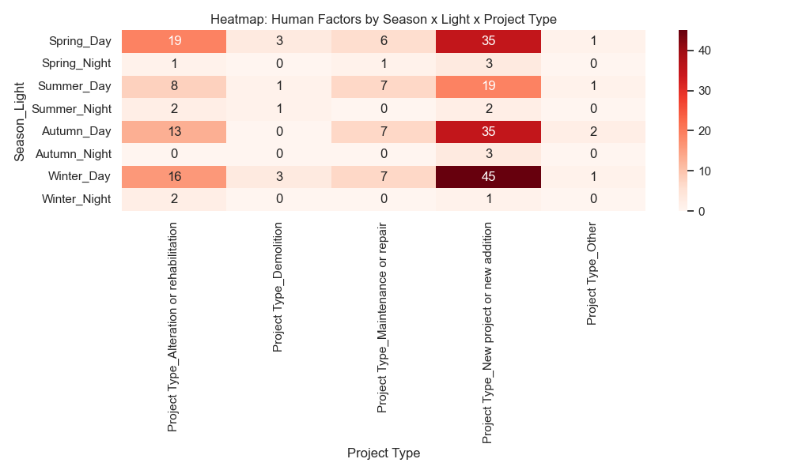
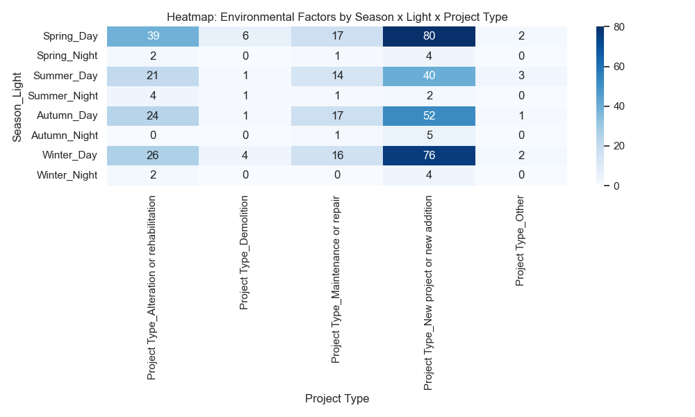
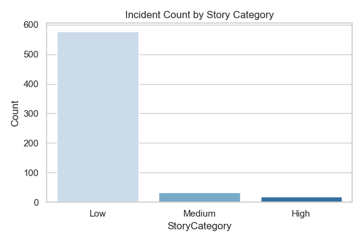

# Construction-Safety-Incidents-Analysis

[](https://www.linkedin.com/in/mohamed-emad-396981344)  

---

## Project Overview
This project analyzes **construction safety incidents**, focusing on **human and environmental factors, project types, construction end-use, seasonal and lighting conditions, and incident costs**. The main goal is to provide actionable insights for **improving safety, reducing risks, and optimizing resource allocation**.

---

## Data & Sources
The dataset contains detailed records of safety incidents with the following key fields:  

- **Event Information:** eventType, normalStory, normalCost  
- **Temporal & Environmental:** Season (Autumn, Spring, Summer, Winter), Light (Day/Night)  
- **Project & Construction:** Project Type, Construction End Use  
- **Human & Environmental Factors:** Multiple binary columns capturing specific causes  

**Data Preparation:**  
- SQL Server queries to summarize and aggregate incidents by multiple dimensions  
- Python (Pandas, Seaborn, Matplotlib) for cleaning, aggregation, and visualization  

---

## Key Insights from Python & SQL

- **Incident Count by Event Type**  
    
  Event Type 1 most frequent (~410 incidents)

- **Average Cost by Event Type**  
    
  Event Type 2 has the highest average cost (~$0.12)

- **Human vs Environmental Factors**  
    
  Environmental factors (~480) outweigh human factors (~245)

- **Incidents by Project Type**  
    
  New Projects/Additions have the highest incidents (~320)

- **Incidents by Construction End Use**  
    
  Multi-family & Other buildings most affected (~150 incidents each)

- **Season & Light Interaction (Heatmap)**  
    
  Highlights how season and lighting affect incident distribution

- **High-Risk Scenarios**  
    
  WinterDayNewProjectOther shows the highest human factor risk (~42–44)

- **Human & Environmental Factors Heatmaps**  
    
    
  Visual comparison of contribution by project type, season, and light

- **Incident Count by Story Category**  
    
  Low severity dominates (~580), medium (~33), high (~18)

---

## Dashboard Overview (Power BI)

**1️⃣ Overview Dashboard**  
- **Cards:** Total Incidents: 628 | Environmental Factors: 469 | Human Factors: 245 | Avg Cost: $0.107  
- **Charts:** Trends of Human vs Environmental Factors by Event Type, Incidents by Season, Incidents by Event Type, Top 10 Human & Environmental Factors, Total Incidents by Factor Category  
- **Filters:** Event Type, Project Type, Season, Light  

**2️⃣ Human & Environmental Factors**  
- Visual comparison of Human vs Environmental Factors for each event type  

**3️⃣ Project & Construction Analysis**  
- **Charts:** Project Type vs Total Incidents, Incidents by Construction End Use, Project Type vs Avg Cost  
- **Highlight:** Most Risky Project Types  

**4️⃣ Seasonal & Lighting Impact**  
- **Charts:** Average Cost by Season, Season vs Lighting Condition (Day/Night), Incident Count by Season  
- **Highlight:** Winter as Most Incident Season  

**5️⃣ Task Assignment & Risk**  
- **Charts:** Regular vs Non-Regular Task Assignments, Task Assignment vs Cost, Task Assignment vs Human Factors  
- **Highlight:** Non-Regular Task Percentage  

**6️⃣ Cost & Severity Analysis**  
- **Charts:** Highest Cost Event, NormalCost vs Event Type, Distribution of Normalized Cost (Very Low → Very High), Total Cost per Project Type  

**7️⃣ High-Risk Scenarios & Heatmaps**  
- **Charts:** Environmental & Human Factors by Season x Light x Project Type  

> Each page includes **cards, slicers, and interactive charts** for detailed analysis and filtering.

---

## Project Structure
```
/ConstructionSafetyAnalysis
│
├─ /SQL_Queries
│ └─ Aggregation & Analysis Queries.sql
│
├─ /Python_Analysis
│ └─ Visualization.ipynb
|
├─ /charts 
│
├─ /PowerBI_Dashboard
│ └─ SafetyIncidents.pbix
│
└─ README.md
```

---

## Key Findings
- Human and environmental factors contribute differently across **project types, seasons, and lighting conditions**  
- New Projects/Additions and certain seasons (Winter, Summer) have **higher incident risk**  
- Task assignments affect **human factor incidence**, highlighting the importance of proper allocation  
- Costs vary significantly by event type and project type, indicating areas for **financial and operational focus**  

---

## Recommendations
- **Prioritize preventive measures** in high-risk project types and seasons  
- **Improve task assignment protocols** to reduce human factor incidents  
- **Allocate safety resources** based on environmental and human factor trends  
- **Regularly monitor dashboards** for near real-time insights  

---

## Author
**Mohamed Emad | Data Analyst** 

***Mechanical Engineering Background***
